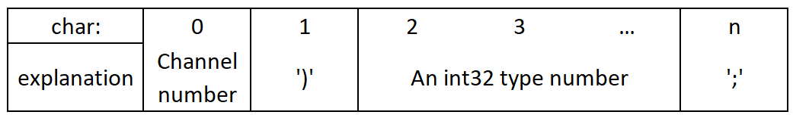

Virtual desktop parser for view oscillographe data from com port. 
Create in QT

# Data Format
**Int32:** A string consisting of this format should be sent to the com port input:

**Float:** A string consisting of this format should be sent to the com port input:

**5 bytes:** The bottom line is that you need to transfer raw data, namely split int32 into 4 8-bit numbers and then send them to com. To separate the channels, we send a number with the first byte - the defining channel number.

Tpd = 1 secons
