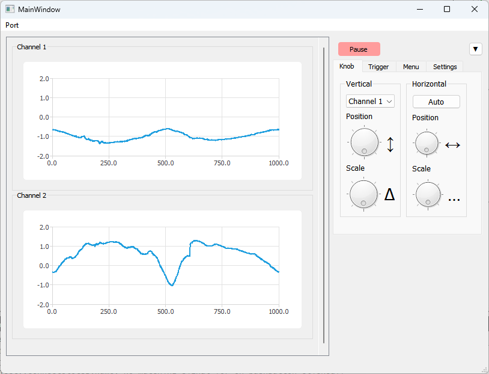

Virtual desktop parser for view oscillographe data from com port. 
Create in QT

# Data Format
**Float:** A string consisting of this format should be sent to the com port input:

The timestamp is determined automatically, it is calculated as: the time from the previous packet divided by the number of points received (Δtd = ΔT/Dots_number)

**Float + time stamp:** A string consisting of this format should be sent to the com port input:

The timestamp is manually determined by the user for each point. The fewer characters used for transmission, the faster the packet is transmitted. Therefore, I recommend choosing from the millisecond, micro and so on formats. If the time is not transmitted correctly, then the time will be determined using the float format.

**5 bytes (Idea):** The bottom line is that you need to transfer raw data, namely split int32 into 4 8-bit numbers and then send them to com. To separate the channels, we send a number with the first byte - the defining channel number.

Tpd = 1 secons
